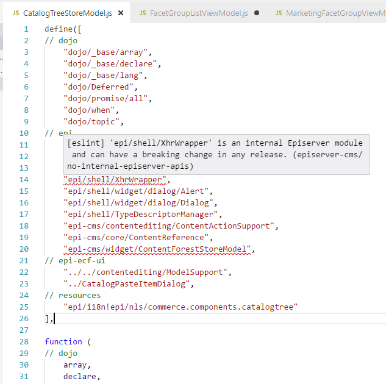

# eslint-plugin-episerver-cms

Makes sure only public non-deprecated Episerver CMS API's are used.



## Installation

You'll first need to install [ESLint](http://eslint.org):

```
$ npm i eslint --save-dev
# or
$ yarn add eslint -D
```

Next, install `eslint-plugin-episerver-cms` and [`eslint-formatter-episerver-cms`](https://github.com/seriema/eslint-formatter-episerver-cms/) from github as it's not ready for npm just yet:

```
$ npm i seriema/eslint-plugin-episerver-cms seriema/eslint-formatter-episerver-cms --save-dev
# or
$ yarn add seriema/eslint-plugin-episerver-cms seriema/eslint-formatter-episerver-cms -D
```

**Note:** If you installed ESLint globally (using the `-g` flag) then you must also install `eslint-plugin-episerver-cms` globally.

## Usage

Add `eslint-epi-cms-api` to the plugins section of your `.eslintrc` configuration file. You can omit the `eslint-plugin-` prefix:

```json
{
    "plugins": [
        "episerver-cms"
    ]
}
```


Then configure the rules you want to use under the rules section.

```json
{
    "rules": {
        "episerver-cms/no-internal-episerver-apis": "error",
        "episerver-cms/no-deprecated-episerver-apis": "warn"
    }
}
```

### Analyzing multiple projects

Install globally (see instructions above), and then run this for any project:

```
$ eslint C:/YourEpiserverProject/ --plugin "episerver-cms" --rule "episerver-cms/no-internal-episerver-apis: error" --rule "episerver-cms/no-deprecated-episerver-apis: warn" --ignore-pattern "node_modules" -f episerver-cms

# output to file:
$ eslint C:/YourEpiserverProject/ --plugin "episerver-cms" --rule "episerver-cms/no-internal-episerver-apis: error" --rule "episerver-cms/no-deprecated-episerver-apis: warn" --ignore-pattern "node_modules" -f episerver-cms -o YourEpiserverProject.json
```

## Recommended config

This plugin exports a [`recommended` config](lib/index.js) that enforces good practices.

Enable it in your `.eslintrc.json` with the `extends` option:

```json
{
    "extends": "plugin:episerver-cms/recommended"
}
```

## Supported Rules

* [no-internal-episerver-apis](docs/rules/no-internal-episerver-apis.md) - Ensure internal Episerver CMS API's are not used, as they can break on any update (including patches).
* [no-deprecated-episerver-apis](docs/rules/no-deprecated-episerver-apis.md) - Ensure deprecated Episerver CMS API's are not used, as they can be removed in the next major release.


## Formatters

There are several formatters you can use to get a clearer overview of what Episerver API's are being used but shouldn't be. If you want to send us some statistics to help us in the CMS UI team, please send us the CSV version. [See all formatters.](https://github.com/seriema/eslint-formatter-episerver-cms)

The formatters need to be installed separately:

```
$ npm i seriema/eslint-formatter-episerver-cms --save-dev
# or
$ yarn add seriema/eslint-formatter-episerver-cms -D
```

Then you can get a summary view with:

```
$ eslint . --format=episerver-cms
```
